# fw-boot-admin-eureka

#### 介绍
fw-boot-admin基于 Spring Boot 2.1.6  、 bootadmin 、security 的监控系统demo

**如果需要查询eureka版的，请移步**[https://github.com/xuyisu/fw-boot-admin-eureka](https://github.com/xuyisu/fw-boot-admin-eureka)

#### 软件架构
- fw-boot-admin 根目录(启动顺序不用关心)
    - fw-boot-admin-server admin监控server端
    - fw-boot-client-a 客户端A
    - fw-boot-client-b 客户端B
#### 安装教程
1. 先拉代码
```
git clone https://github.com/xuyisu/fw-boot-admin.git
```
2. 代码如图所示
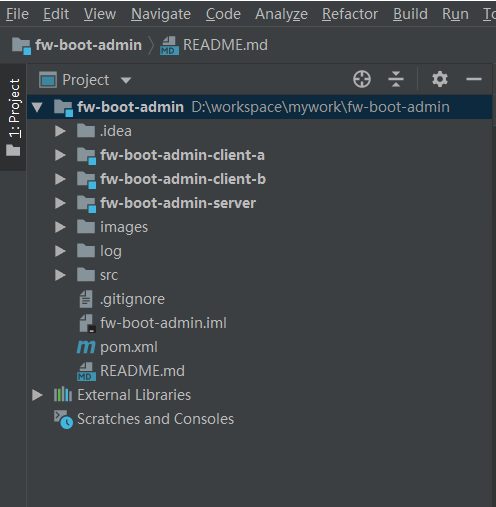
3. 启动fw-boot-admin-server
4. 浏览器输入`localhost:8762`查看监控信息 账号密码:admin admin
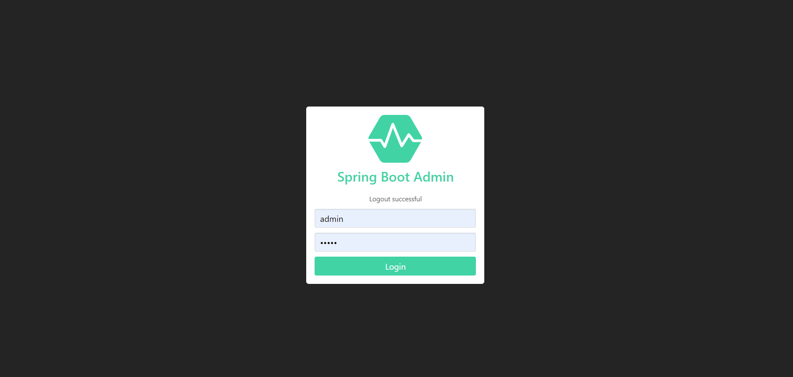
5. 登陆完成之后，进入监控的信息页面
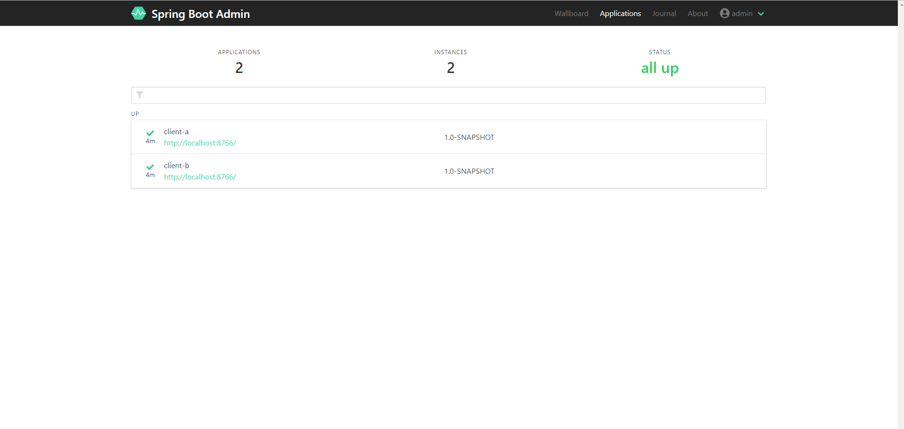
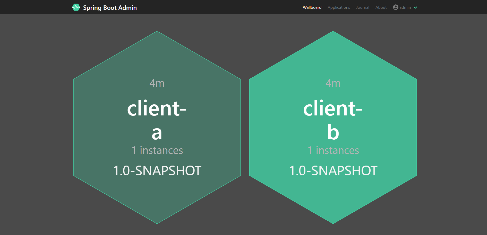
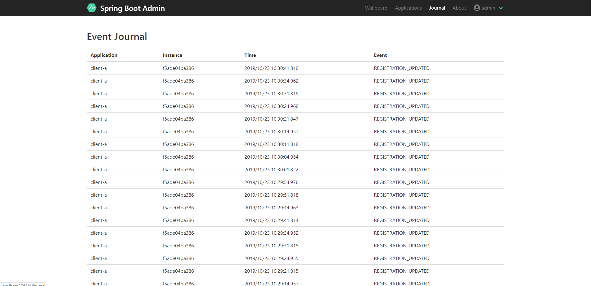
6. 可以看到具体的监控信息,如机器配置信息、请求路径、jvm等信息
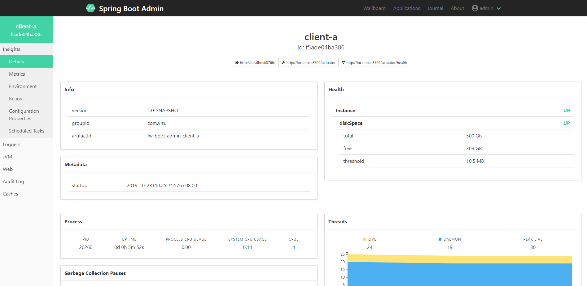
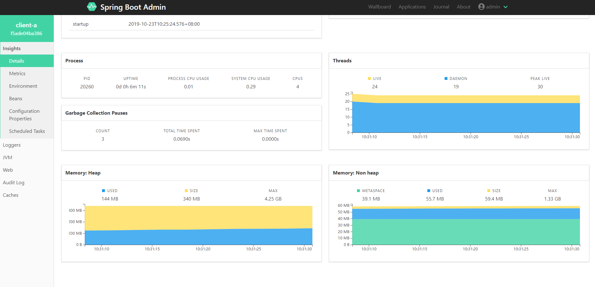
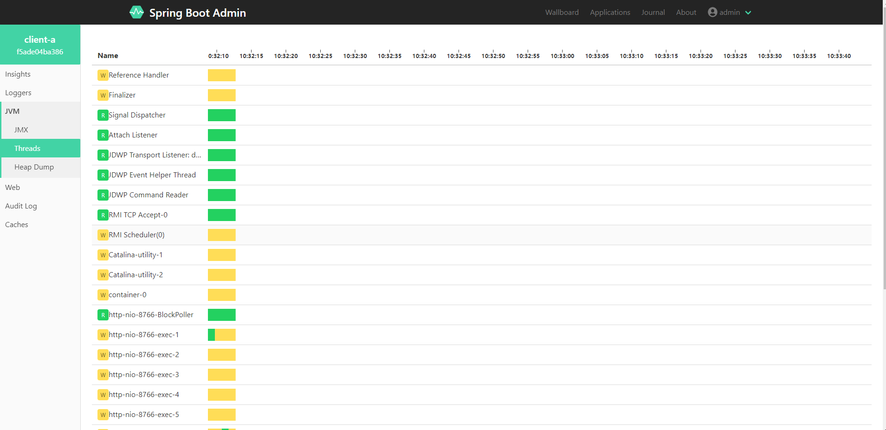
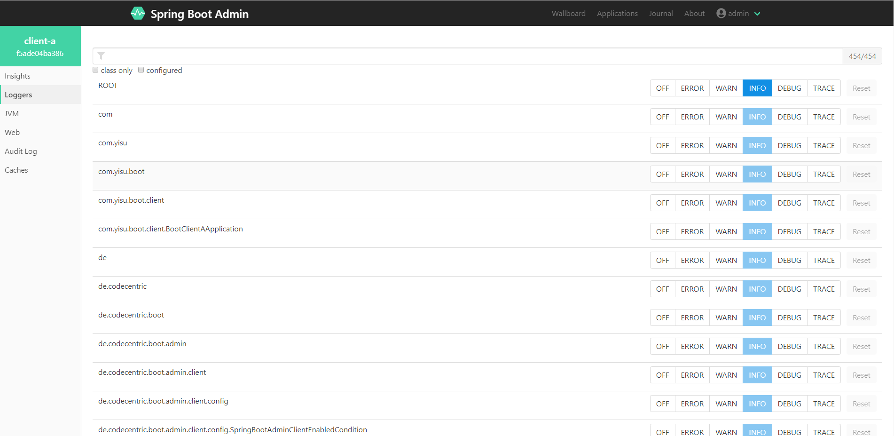
#### 说明
1. fw-boot-admin-server中添加了邮件的配置，主要的pom内容如下
``` pom
<dependencies>
        <dependency>
            <groupId>de.codecentric</groupId>
            <artifactId>spring-boot-admin-server</artifactId>
            <version>2.1.6</version>
        </dependency>
        <dependency>
            <groupId>de.codecentric</groupId>
            <artifactId>spring-boot-admin-server-ui</artifactId>
            <version>2.1.6</version>
        </dependency>
        <dependency>
            <groupId>org.springframework.boot</groupId>
            <artifactId>spring-boot-starter-web</artifactId>
        </dependency>
        <dependency>
            <groupId>org.springframework.cloud</groupId>
            <artifactId>spring-cloud-starter-security</artifactId>
        </dependency>
        <dependency>
            <groupId>org.springframework.boot</groupId>
            <artifactId>spring-boot-starter-mail</artifactId>
        </dependency>
</dependencies>
```
server 段的邮件配置(自己注册申请账号)
``` yml
server:
  port: 8762
spring:
  application:
    name: fwe-boot-admin
  security:
    user:
      name: admin
      password: admin
  boot:
    admin:
      ui:
        title: ${spring.application.name}
  #邮件配置开始
      notify:
        mail:
          from: ------@163.com  #这个如果没有的话，发邮件会报错
          to: -----@qq.com
  mail:
    host: smtp.163.com
    username: -----@163.com
    password: -----
```
这样生产如果应用下线，可以收入如下邮件内容，供预警使用
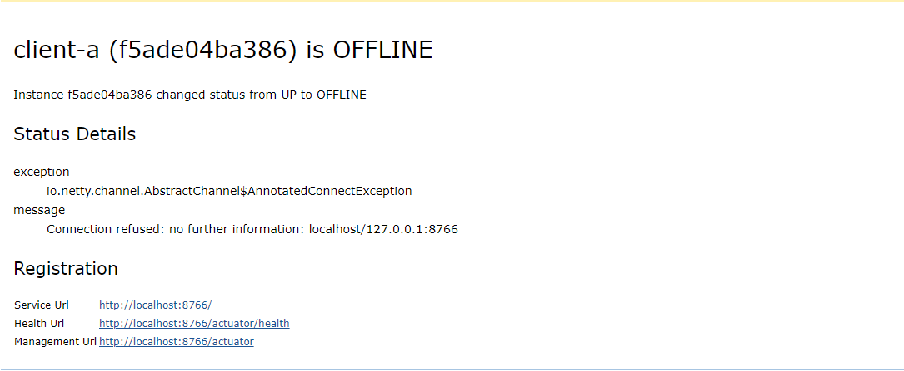

#### 项目点赞
**如果你用爽了，可以请作者点个start,谢谢**
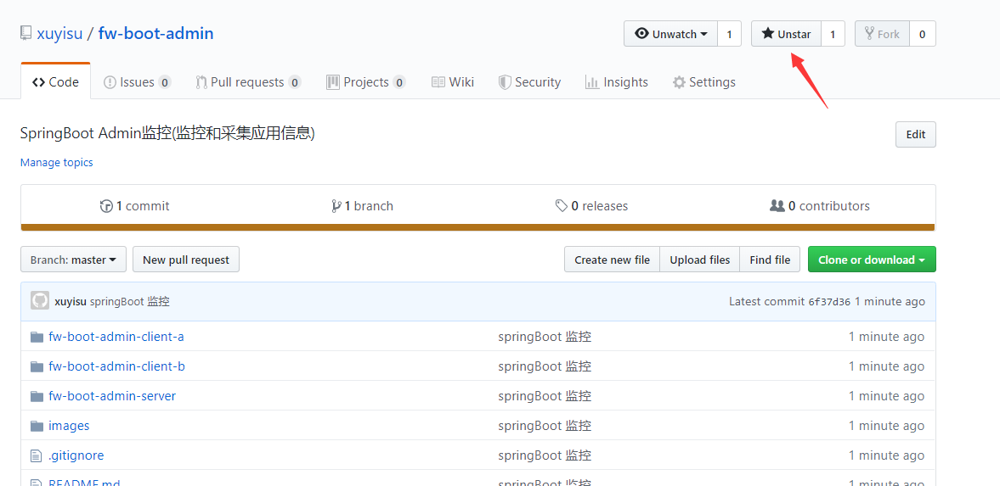


